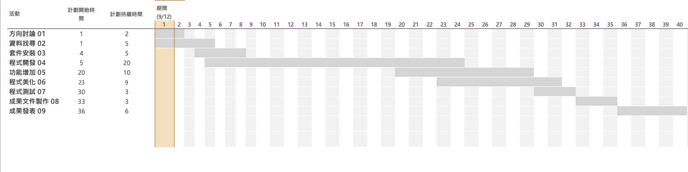
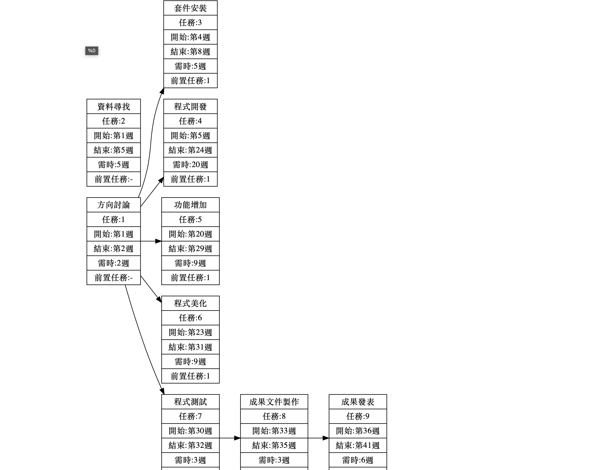

# 第七組作業

| 職稱  | 組員             | 工作內容    |
| :----------- | :---------------------:| :---------- |
| 組長  | C109118139 李國禎 | 方向討論、資料找尋、套件安裝、程式開發、功能增加、程式測試、成果發表|
| 組員  | C109118112 林連恩| 方向討論、套件安裝、程式開發、功能增加、程式美化、程式測試 |
| 組員  | C109118123 游雅  | 方向討論、資料找尋、件安裝、程式開發、功能增加、程式測試、成果文件製作|
| 組員  | C109118146 許瑋展|  方向討論、資料找尋、套件安裝、程式開發、功能增加、程式美化、程式測試 |
| 組員  | C109118163 嚴偉哲 | 方向討論、套件安裝、程式開發、功能增加、程式美化、程式測試 |
---
## 甘特圖(範本)

---
##PERT

