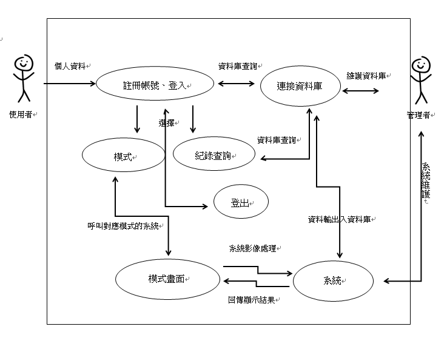

### 功能性需求與非功能性需求

|項目|內容|
|:-------|:-----|
|功能性需求|協助運動人士紀錄資訊|
||幫助運動中的人計算次數|
||提供有趣模式|
|非功能性需求|反應時間(response time):125ms|
||可靠度(reliability):網路異常失敗率100%|
||可靠度(reliability):網路正常失敗率10%|
||使用性(usability):5分鐘|

---
### 功能分解圖(functional decomposition diagram, FDD)

---
### 需求分析的文字描述

>使用者
>
>>可使用程式幫助計算運動次數
>>
>>可查詢過去運動紀錄
>>
>>登入帳號

>管理者
>
>>	透過資料庫管理用戶帳號

---
### 使用案例圖與使用案例說明

|名稱|運動計數器|
|:-------|:-----|
|行動者|運動人士|
|說明|使用運動程式過程|
|完成動作|1.	開啟運動程式並將裝置放置在適當位置|
||2.	透過裝置鏡頭記錄運動者動作|
||3.	計算使用者完成動作次數(後端程式執行)|
||4.	回傳給使用者次數|
|替代方案||
|先決條件|使用者需開啟程式及開啟鏡頭權限|
|後置條件|完成一組動作可再重新計算次數|
|假設|無|

---
### 使用Figma劃出第一個使用案例的動態模擬畫面

